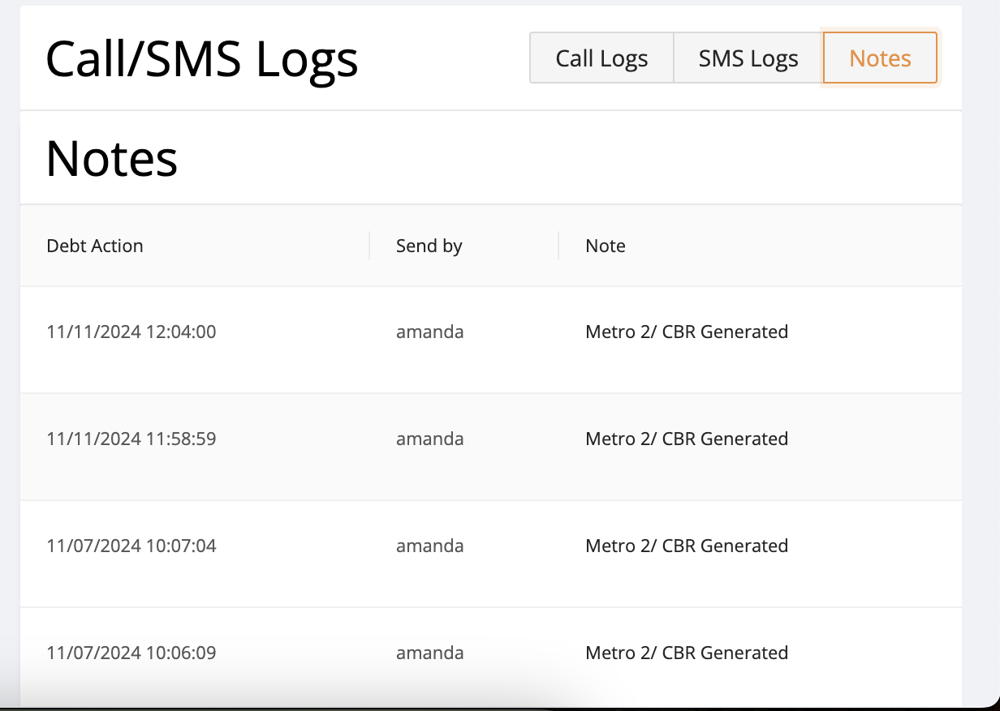

- DONE SNAP-12
  :LOGBOOK:
  CLOCK: [2024-11-12 Tue 04:27:21]--[2024-11-12 Tue 15:04:17] =>  10:36:56
  :END:
	- ```apl
	  data: {
	        error: 'invalid_client',
	        error_description: "AADSTS7000215: Invalid client secret provided. Ensure the secret being sent in the request is the client secret value, not the client secret ID, for a secret added to app '07eb5996-8951-4017-bbfc-d15696be7bca'. Trace ID: 6d7f7726-1ef6-4aac-bca4-4b8d78e69e01 Correlation ID: f8dd7364-2002-4f5a-ac22-3e93557bf827 Timestamp: 2024-11-12 00:16:40Z",
	        error_codes: [Array],
	        timestamp: '2024-11-12 00:16:40Z',
	        trace_id: '6d7f7726-1ef6-4aac-bca4-4b8d78e69e01',
	        correlation_id: 'f8dd7364-2002-4f5a-ac22-3e93557bf827',
	        error_uri: 'https://login.microsoftonline.com/error?code=7000215'
	      }
	    }
	  ```
- DONE SNAP-22
  :LOGBOOK:
  CLOCK: [2024-11-12 Tue 05:22:55]--[2024-11-12 Tue 05:35:18] =>  00:12:23
  :END:
	- 
- DONE SNAP-70 -> Issue comes after moving co debtor to down -> Farooq is working on it
  :LOGBOOK:
  CLOCK: [2024-11-12 Tue 05:36:00]--[2024-11-12 Tue 21:47:20] =>  16:11:20
  :END:
- DONE SNAP-68 -> Not receiving emails
  :LOGBOOK:
  CLOCK: [2024-11-12 Tue 05:37:17]--[2024-11-12 Tue 06:22:40] =>  00:45:23
  :END:
- DONE SNAP-67 -> Must be an issue in csv file
  :LOGBOOK:
  CLOCK: [2024-11-12 Tue 05:58:22]--[2024-11-12 Tue 15:04:50] =>  09:06:28
  :END:
- DONE SNAP-19
  :LOGBOOK:
  CLOCK: [2024-11-12 Tue 06:23:53]--[2024-11-12 Tue 21:47:22] =>  15:23:29
  :END:
-
- Removed following from staging
	- ```apl
	  ```