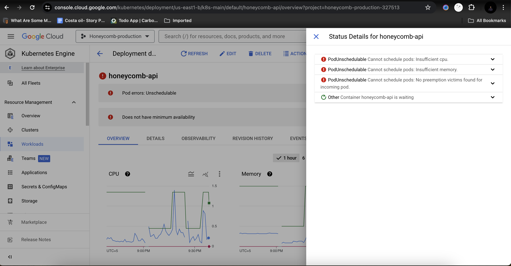

- HoneyComb is a [[Crowdfunding]] platform. There is a pool of investors and pool of businesses and honeycomb is acting like broker between them.
- # Business Domain
	- ## User Module
		- User can be an **Investor** and **owner**. User can be both at a time
			- ### Investor
				- Investor is classified into three categories
					- #### Non Credited Investor
						- When new investor will sign up. He will be a non credited investor. Investment limit will be $2500 by default on joining the coneycomb platform
						  
						  Non credited Investor can increase the investment limit. He will provide annual report, Net worth , Current [[Reg Cef]] investments. 
						  
						  **Important Note** . After an increase in investment limit, investor will have to invest between $2500 and $124000. This range is only valid for 1 year. After one year again limit below $2500 will be applied automatically. There is a formula in backend code which validates this limit
						  
						  Also Read about [[FINRA Compliance]]
						- **Question**: Admin will approve investor to move from non credit investor to credited investor?
						-
					- #### Credited Investor
						- Investor will fill three questions for unlimited investment for 1 year
					- #### Intermediaries
						- Intermediary will behave as a middle man for investment on behalf of businesses
						  
						  There are two profiles of him 1 - as an Investor and 2 - as an intermediatry
						  Intermediary is also referred as an Entity.
					- #### Investor Sign Up flow
						- On sign up third party service ideology is used for KYC. For staging specific KYC info is used for approving . Fahad will share it
						- Check KYC three times, if on third time if KYC is not approved, customer is redirected to upload documents page
						- Honeycomb will pass KYC on admin Panel
						- On successful KYC approval or on admin approval, following accounts are created
							- On Dwolla Two customers are created
								- Personal
								  Only personal customer account for virtual wallet is created for repayments  
								  **HYBRID PAYMENTS** Transaction from both wallet and bank. E.g 
								  Minimum investment in campaign is $100. In hybrid there can be two transactions $50 from wallet and $50 from bank 
								  Free charged will be on bank transaction only
								- Business
							- USA EPAY
								- Its a payment process
								- Only Banks ACH payments are accepted on USA Epay. Also ***veri check*** term is used by clients
							- Stripe account
								-
					- Investor will attach bank account through PLAID
						- ***Only bank account or stripe account at a time ***
						-
						-
				- #### Payment Methods
					- ##### Bank Account
					  1 - Manual
					  2 - PLAID
					  3 - Voided Check
					- ##### Credit Card
			- ### Owner
				- Honeycomb support team will add owners. There is one column <ins>isBusinessUser</ins>  in db and this flag helps us to identify owner has created a business in honeycomb or not
					- #### Primary Onwer
					  Need to understand from fahad again. ***Fahad will discuss it in more details***
					- #### Benefical Onwer
					  If shares is more than 25%.
				-
	- ## Business Module
		- We also called it an issuer in our system.
		- Types of legal entity of business
			- LLC
			- Corporation
			- Partnership
			- Sole Propertership ?
		- How to add business in honeycomb?
			- There is a service loanwell. FIle is exported from loanwell and it includes owner data, business data and campaign data
			- One business has multiple onwers.  On production there is no use case in which single owner handles multiple business.
			-
			-
	- ## Campaign Module
		- Honeycomb will run campaigns of business.
		- Business can have multiple campaigns
		- Only one campaign is launched at a time
			- While creating campaign following details are added
				- Funding goals , set min and max funding goals
				- time required to run campaign
				- Types of campaign like quity, debt , convertable and offering type and note Can be found on admin panel.
				- Campaign timezone
				- Loan duration
				- Campaign documents
					- Note Purchase agreement. NPA is required. This document includes investment amount, repayment schedule, **Read documents for more details **
						- FORM CU , FORM CA,Legal documents.
						- These documents are submitted at different times during campaign and we are not saving any record in honeycomb system
					- ***Its only debt revenue share and convertable note ?***
					- ***Subscription Agreement ?***
				- Repayment schedule
					- Weekly
					- Monthly
					- Quartely
				- Add media in campaign. Media can be youtube link or image
					- No campign will go live unless media is added.
				- Add relevant tags of campaign
				- Use of funds in campaign details
				- Campaign stages
					- Onboarding
					- Fund raising
					- Funded - > min amount in net
					- Not funded
					- Fully Repaid
				- Requirements for campaign to go live
					- Media should be added
					- Use of funds details should be added
					- Stage of campaign should be fund raising
					-
	- ## Investment Module / Campaign fundings
		-
- # Production Branches
	- ## API
		- production
	- ## Web App
		- prod_setup
	- ## Admin Panel
		- production
	-
- # HoneyComb links
	- ## Staging
		- [https://hcc-ap.honeycombcredit.com](https://hcc-ap.honeycombcredit.com)
	- ## Live
		- [https://invest.honeycombcredit.com/](https://invest.honeycombcredit.com/)
- # Devops Notes
	- https://issuetracker.google.com/issues/236882544
- # Pritunel Notes
	- ## PIN
		- PIN in saved in sticky notes
		- 95100159
		- PIN is upload in drive
		- https://www.instagram.com/p/B3U7KWYl55l/?hl=en
	-
- # Honeycomb Business Flow Diagram
	- [Google Drive Link](https://www.figma.com/file/hDLQH6XLupcDZF1trBPX3w/Honeycomb-Wallet---Dwolla-Integration-Flow?type=whiteboard&node-id=0-1&t=SHtyaoAcJq4NF5xM-0)
- # Business Repayment
	- Business transfer funds from business bank to wallet
- # Investor Repayment
	- Funds transfer from investor wallet to business bank
- # Types of Wallet
	- Personal wallet
	- Business wallet
- # Github build example in attachment
	- 
- # Investment Code Notes
	- [[Investment Backent Api Notes]]
	- [[HoneyComb Config File]]
	- [[honeycomb ERD diagram]]
	- [[Tables Involve In Investment]]
	- [HoneyComb Staging Data Drive link](https://docs.google.com/document/d/1WJEYP27L8bQlHReOpuAZ_5ogw5ojnQGG9Zn_iVzf8KE/edit)
- ## Home Ip
	- 39.38.234.103
	-
- # Node Versions
	- ## Backend API
		- v12.22.12
	- ## Admin Panel
		- v16.20.2
	- ## WEB APP
		- v14.21.3 -> yarn dev
		-
- # Honeycomb Devops Issue
	- 
	-
- # Low Usage Time
	- 12pm to 3pm EST  -> Minimum Traffic -> 2am to 7am
- Rayments Link
	- [https://www.figma.com/file/YF7zqNwBNAKsoRNtqGk0Fa/HC-1897-Self-service-payment-management?type=design&node-id=0-1&mode=design&t=kWNnfsqYJFpgt4SS-0](https://www.figma.com/file/YF7zqNwBNAKsoRNtqGk0Fa/HC-1897-Self-service-payment-management?type=design&node-id=0-1&mode=design&t=kWNnfsqYJFpgt4SS-0)
- HC-2425
	- Schedule for future
	- e.g loan term of 36 months
- # Honeycomb Testing account
	- pehapo4264@huleos.com
	- Honeycomb123!@#
- # HELM SECRETS COMMANDS
	- gcloud auth application-default login
	- Credentials saved to file: [/.../.config/gcloud/application_default_credentials.json]
	- helm secrets view secrets.yaml
	- helm secrets edit secrets.yaml
- # Recapchata Notes
	- https://console.cloud.google.com/security/recaptcha?project=honeycomb-production-327513
- /Users/irfanshahzad/Workspace/honeycomb-api/honeycomb-staging-key.json
- # Q3 Goals
	- https://docs.google.com/document/d/1IIGsZ_tsU4HqpLZmdy9AagMyz-r0I2QTj1E_fC12qQc/edit
- ## FireBase file path for my local machine
	- /Users/irfanshahzad/Workspace/honeycomb-api/honeycomb-firebase-staging-adminsdk.json
- ## Honeycomb Mobile Testing Account for App Store
	- [joe+testaccount@honeycombcredit.com](mailto:joe+testaccount@honeycombcredit.com)
	  Honeycomb@7194!
- ```apl
  select @email := 'andy.somerville@gmail.com';
  select @campaignName := 'Harvie';
  select @amount := 1000;
  select @fee := 0;
  select @tradeId := 422025927;
  select @refrenceNumber := NULL;
  select @transactionType := 'ACH';
  select @dwollaTransactionId := NULL;
  select @individualACHId := NULL;
  
  # internal IDs.
  select @chargeId := UUID();
  select @campaignFundId := UUID();
  select @hybridTransactionId := UUID();
  select @now := NOW();
  
  select investorId, annualIncome, netWorth, isAccredited into @investorId,  @annualIncome,  @netWorth,  @isAccredited from users u join investors i on u.userId=i.userId where email=@email and i.deletedAt is null;
  select campaignId, typeOfSecurityOffered into @campaignId, @typeOfSecurityOffered from campaigns where campaignName = @campaignName and deletedAt is null;
  
  insert into charges(chargeId, chargeType, dwollaChargeId, chargeStatus, applicationFee, createdAt, `updatedAt`) values(@chargeId, 'transfer', 0, 'pending', @fee, @now, @now);
  insert into campaignFunds(campaignFundId, amount, investorAccreditationStatus, investorNetWorth, investorAnnualIncome, investmentType, createdAt, updatedAt, campaignId, investorId, chargeId)
  values(@campaignFundId, @amount, @isAccredited, @netWorth, @annualIncome, @typeOfSecurityOffered, @now, @now, @campaignId, @investorId, @chargeId);
  
  insert into hybridTransactions(hybridTransactionId, amount, transactionType, refrenceNumber, dwollaTransactionId, individualACHId, createdAt, updatedAt, campaignFundId, applicationFee,tradeId)
  values(@hybridTransactionId, @amount, @transactionType, @refrenceNumber, @dwollaTransactionId, @individualACHId, @now, @now, @campaignFundId, @fee,@tradeId);
  select @chargeId, @campaignFundId, @hybridTransactionId;
  ```
- ## Mobile Configuration Code
- ```apl
      // After Mobile Promotion , we will remove this logic
      if (isMobilePlatform) {
        globalConfiguration['configuration']['ACH']['feeCap'] = 0;
        globalConfiguration['configuration']['ACH']['transactionFeeVarriable'] = 0;
        globalConfiguration['configuration']['HYBRID']['feeCap'] = 0;
        globalConfiguration['configuration']['HYBRID']['transactionFeeVarriable'] = 0;
        globalConfiguration['configuration']['CREDITCARD']['feeCap'] = 0;
        globalConfiguration['configuration']['CREDITCARD']['transactionFeeVarriable'] = 0;
      }
      
  ```
- ##  Frontend App Temp Issue Fix
- ```export async function getServerSideProps() {
   export async function getServerSideProps() {
    return {
      props: {},
    };
  }
  ```