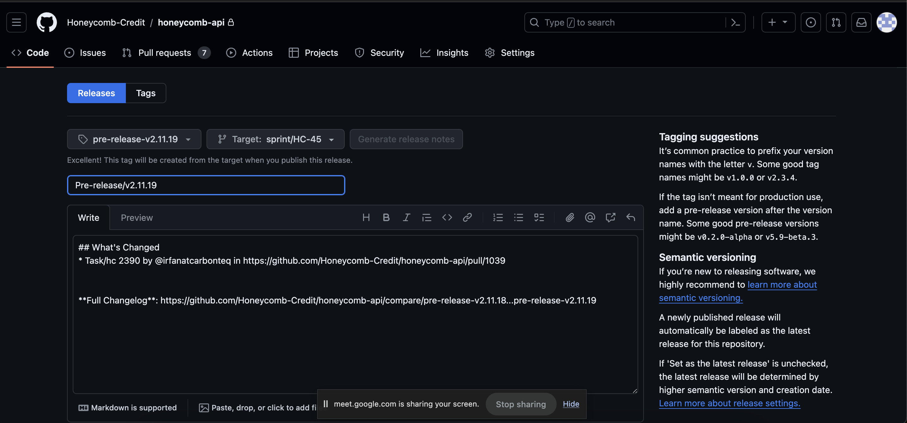

- HoneyComb is a [[Crowdfunding]] platform. There is a pool of investors and pool of businesses and honeycomb is acting like broker between them.
- # Business Domain
	- ## User Module
		- User can be an **Investor** and **owner**.
			- ### Investor
				- Investor is classified into three categories
					- #### Non Credited Investor
						- When new investor will sign up. He will be a non credited investor. Investment limit will be $2500 by default on joining the coneycomb platform
						  
						  Non credited Investor can increase the investment limit. He will provide annual report, Net worth , Current [[Reg Cef]] investments. 
						  
						  **Important Note** . After an increase in investment limit, investor will have to invest between $2500 and $124000. This range is only valid for 1 year. After one year again limit below $2500 will be applied automatically. There is a formula in backend code which validates this limit
						  
						  Also Read about [[FINRA Compliance]]
						- **Question**: Admin will approve investor to move from non credit investor to credited investor?
						-
					- #### Credited Investor
						- Investor will fill three questions for unlimited investment for 1 year
					- #### Intermediaries
						- Intermediary will behave as a middle man for investment on behalf of businesses
						  
						  There are two profiles of him 1 - as an Investor and 2 - as an intermediatry
						  Intermediary is also referred as an Entity.
					- #### Investor Sign Up flow
						- On sign up third party service ideology is used for KYC. For staging specific KYC info is used for approving . Fahad will share it
						- Check KYC three times, if on third time if KYC is not approved, customer is redirected to upload documents page
						- Honeycomb will pass KYC on admin Panel
						- On successful KYC approval or on admin approval, following accounts are created
							- On Dwolla Two customers are created
								- Personal
								  Only personal customer account for virtual wallet is created for repayments  
								  **HYBRID PAYMENTS** Transaction from both wallet and bank. E.g 
								  Minimum investment in campaign is $100. In hybrid there can be two transactions $50 from wallet and $50 from bank 
								  Free charged will be on bank transaction only
								- Business
							- USA EPAY
								- Its a payment process
								- Only Banks ACH payments are accepted on USA Epay. Also ***veri check*** term is used by clients
							- Stripe account
								-
					- Investor will attach bank account through PLAID
						- ***Only bank account or stripe account at a time ***
						-
						-
				- #### Payment Methods
					- ##### Bank Account
					  1 - Manual
					  2 - PLAID
					  3 - Voided Check
					- ##### Credit Card
			- ### Owner
				- Honeycomb support team will add owners. There is one column <ins>isBusinessUser</ins>  in db and this flag helps us to identify owner has created a business in honeycomb or not
					- #### Primary Onwer
					  Need to understand from fahad again. ***Fahad will discuss it in more details***
					- #### Benefical Onwer
					  If shares is more than 25%.
				-
	- ## Business Module
		- We also called it an issuer in our system.
		- Types of legal entity of business
			- LLC
			- Corporation
			- Partnership
			- Sole Propertership ?
		- How to add business in honeycomb?
			- There is a service loanwell. FIle is exported from loanwell and it includes owner data, business data and campaign data
			- One business has multiple onwers.  On production there is no use case in which single owner handles multiple business.
			-
			-
	- ## Campaign Module
		- Honeycomb will run campaigns of business.
		- Business can have multiple campaigns
		- Only one campaign is launched at a time
			- While creating campaign following details are added
				- Funding goals , set min and max funding goals
				- time required to run campaign
				- Types of campaign like quity, debt , convertable and offering type and note Can be found on admin panel.
				- Campaign timezone
				- Loan duration
				- Campaign documents
					- Note Purchase agreement. NPA is required. This document includes investment amount, repayment schedule, **Read documents for more details **
						- FORM CU , FORM CA,Legal documents.
						- These documents are submitted at different times during campaign and we are not saving any record in honeycomb system
					- ***Its only debt revenue share and convertable note ?***
					- ***Subscription Agreement ?***
				- Repayment schedule
					- Weekly
					- Monthly
					- Quartely
				- Add media in campaign. Media can be youtube link or image
					- No campign will go live unless media is added.
				- Add relevant tags of campaign
				- Use of funds in campaign details
				- Campaign stages
					- Onboarding
					- Fund raising
					- Funded - > min amount in net
					- Not funded
					- Fully Repaid
				- Requirements for campaign to go live
					- Media should be added
					- Use of funds details should be added
					- Stage of campaign should be fund raising
					-
	- ## Investment Module / Campaign fundings
		-
- # Points to ask from Fahad
	-
	-
- # HoneyComb links
	- ## Staging
		- [https://hcc-ap.honeycombcredit.com](https://hcc-ap.honeycombcredit.com)
	- ## Live
		- [https://invest.honeycombcredit.com/](https://invest.honeycombcredit.com/)
- # Devops Notes
	-
- # Pritunel Notes
	- ## PIN
		- PIN in saved in sticky notes
		- 95100159
		- PIN is upload in drive
		- https://www.instagram.com/p/B3U7KWYl55l/?hl=en
	-
- # Honeycomb Business Flow Diagram
	- [Google Drive Link](https://www.figma.com/file/hDLQH6XLupcDZF1trBPX3w/Honeycomb-Wallet---Dwolla-Integration-Flow?type=whiteboard&node-id=0-1&t=SHtyaoAcJq4NF5xM-0)
- # Business Repayment
	- Business transfer funds from business bank to wallet
- # Investor Repayment
	- Funds transfer from business wallet to business bank
- # Types of Wallet
	- Personal wallet
	- Business wallet
- # Github build example in attachment
	- 
- # Investment Code Notes
	- [[Investment Backent Api Notes]]
	- [[HoneyComb Config File]]
	- [[honeycomb ERD diagram]]