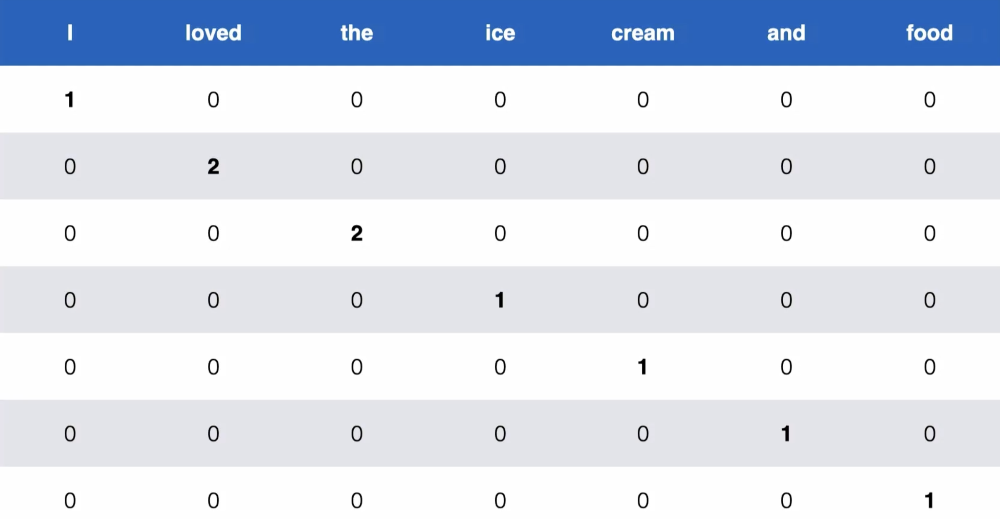

- [Plural Sight Tutorial link](https://app.pluralsight.com/ilx/video-courses/1247d1e0-3fa6-45b5-b951-166740294add/25da33f0-8d5d-43cd-9636-528af02476f6/3b56d81b-4d2a-4d9f-93a2-3672e584d63d)
- [Tutorial Colab link](https://colab.research.google.com/github/axel-sirota/implement-nlp-word-embedding/blob/main/module3/Module3_Demo1_Using_One_Hot_Encodings.ipynb#scrollTo=R8aZ3C9aNB27)
- [Personal Colab link](https://colab.research.google.com/drive/1kLZvCSETTv5yHgMPIClRyb2ev5GWJ7ai)
-
- ## Things to cover
	- [[TensorFlow]]
- [[NLP]]
- [[Word Embeddings]]
- ## Why Process Text?
	- [Github link](https://github.com/axel-sirota/implement-nlp-word-embedding/blob/main/module3/Module3_Demo1_Using_One_Hot_Encodings.ipynb)
	- To extract value from text
	- e.g to extract harmful tweet against company
	- to construct speech
	- With legacy techniques we are unable to detect similarities between words
- ## Globomantics Case Study
	- Globomantics wants to analyize semantics of reviews
- ## Training Word Representation
	- ### How to represent words
		- Lets suppose we have a dataset of reviews and sentiment on scale from 1 to 5.
		- We will use dataset to train a model such that we could get a new review and predict sentiment scale
		- Now a model is a function which takes numerical inputs and returns number
		- Mapping sentence into numerical representation is known as embedding
		- We can plot words through embedding on graph and from graph we can measure similarity between words
		- [[One Hot Encoding]] is one form of embedding
	- ### First Embedding [[One Hot Encoding]]
		- Representing a sentence e.g I loved the ice cream and loved the food
		- Its vocabulary will be vocabulary ={I,loved,the,ice,cream,and,food}
		- {:height 381, :width 718}
		- loved and the appear two times so count is 2 and others has count 1
		- Collapsing into vector {1,2,2,1,1,1,1}
		- [https://github.com/axel-sirota/implement-nlp-word-embedding/blob/main/module3/Module3_Demo1_Using_One_Hot_Encodings.ipynb](Github Link of tutorial ipynb)
			- ```apl
			  import pandas as pd
			  import numpy as np
			  from sklearn.feature_extraction.text import CountVectorizer
			  from textblob import TextBlob, Word
			  import nltk
			  nltk.download('punkt')
			  
			  %matplotlib inline
			  sns.set(rc={'figure.figsize':(20,20)})
			  import warnings
			  warnings.filterwarnings('ignore')
			  ```
		- [[TextBlob]]
		- [[📌 Pandas]]
		- [[numpy]]
		- ```apl
		  one_hot_vectorizer = CountVectorizer()
		  one_hot_representation = one_hot_vectorizer.fit_transform(corpus).toarray()
		  one_hot_representation
		  ```
		- [[CountVectorizer]]
		- ```apl
		  one_hot_representation = one_hot_vectorizer.fit_transform(corpus).toarray()
		  ```
		- `corpus` is expected to be a list of text documents (e.g., `["I love NLP", "TextBlob is cool"]`)
		- fit_transform(corpus)
			- **fit**: learns the vocabulary (i.e., all unique words across the corpus).
			  logseq.order-list-type:: number
			- **transform**: converts each document into a vector based on that vocabulary, counting how many times each word appears.
			  logseq.order-list-type:: number
			- The result is a [[Sparse Matrix]] , meaning it only stores positions where counts are non-zero.
			  logseq.order-list-type:: number
			- `.toarray()` converts that sparse matrix into a regular 2D NumPy array so it's easier to view and work with.
			  logseq.order-list-type:: number
		- ohe_rep.shape
			- Output -> (rows, columns)
			  logseq.order-list-type:: number
			- **rows** → Number of documents in your corpus.
			  logseq.order-list-type:: number
			- **columns** → Number of unique words (features) in the vocabulary.
			  logseq.order-list-type:: number
		- ```apl
		  good_vector = np.zeros(ohe_rep.shape[1])
		  good_vector[features.index('good')] = 1
		  good_vector
		  ```
		- ### What's happening here?
			- `np.zeros(ohe_rep.shape[1])` creates a **1D NumPy array filled with zeros**.
			- So this creates a vector like `[0, 0, 0, ..., 0]` — one slot for each word in the vocabulary.
			- good_vector[features.index('good')] = 1, output [0, 0, ..., 1, ..., 0]
		- ```apl
		  np.inner(good_vector.T, excellent_vector)
		  ```
		- ### What it does:
			- `np.inner(a, b)` computes the **inner product** (a.k.a. dot product) of two vectors.
			- `good_vector.T` is the **transpose** of `good_vector` — but since it's a 1D array, the transpose doesn't actually change anything. It's the same as `good_vector`.
				- ###### What is transpose?
					- in simple terms, the **transpose** of a matrix is when you **flip it over its diagonal**, meaning:
						- Rows become columns
						- Columns become rows
						- e.g
						- ```apl
						  A = [[1, 2, 3],
						       [4, 5, 6]]
						  
						  A.T = [[1, 4],
						         [2, 5],
						         [3, 6]]
						  
						  ```
- ## Analyzing sentiments with OHE
	- [Github link](https://github.com/axel-sirota/implement-nlp-word-embedding/blob/main/module3/Module3_Demo2_Analysing_Sentiment_With_OHE.ipynb)
	- [[PyTorch]]
	-
- # Important Points
- [[punkit]]
- [[TextBlob]]
- [[%matplotlib inline]]
	-
-
- ### Points to Ponder
	- Words -> Tokens
	- Sentence -> documents (collection of tokens)
	- Dataset of reviews -> Corpus (Collection of documents)
	- All different words in dataset -> Vocabulary
	-