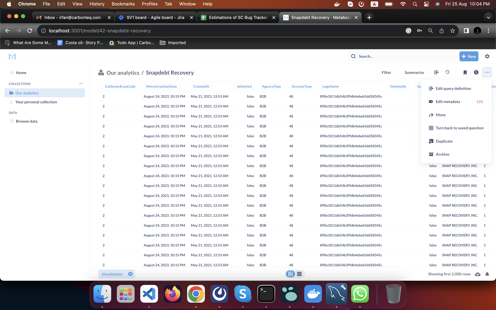

- Links Hammad Shared
	- https://www.metabase.com/glossary/sample_database
	- https://www.metabase.com/glossary/query_builder
	- https://github.com/zackyang000/node-odata/blob/master/examples/simple/index.js
	- https://www.npmjs.com/package/odata
	- https://www.odata.org/getting-started/learning-odata-on-postman/
	- https://github.com/ukrbublik/react-awesome-query-builder/tree/master
	- https://cloudtables.com/
-
- Metabase Points
	- Metabase connects to a database
- Tools I looked for ETL Tools(Extract, Transform and load)
	- redash
	- retool
	- redash and retool ask users to write queries
	-
- # Metabase Notes
	- Figure out how we will edit models once it created(http://localhost:3001/model/42-snapdebt-recovery/query)
		- Clicking on edit query definition will redirect us to update model
		- 
		-
	- You can edit questions from our analytics tab
	-
	-