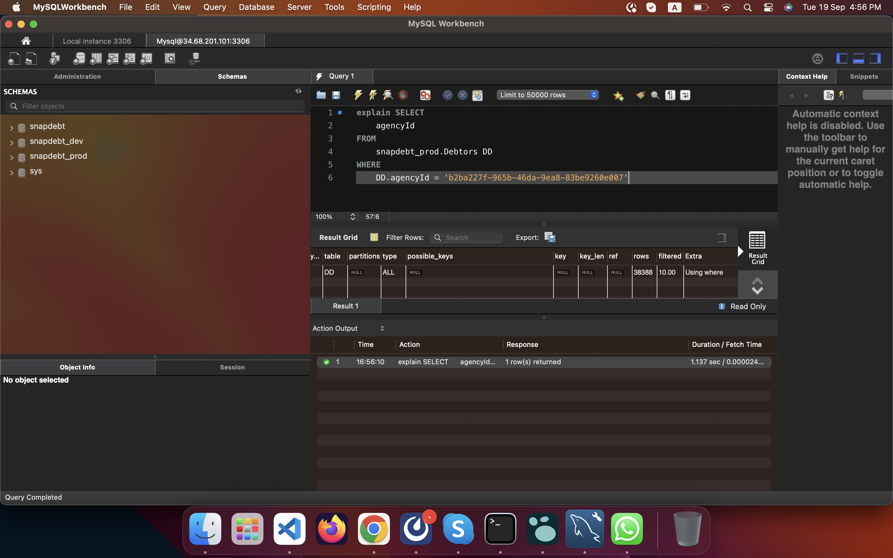
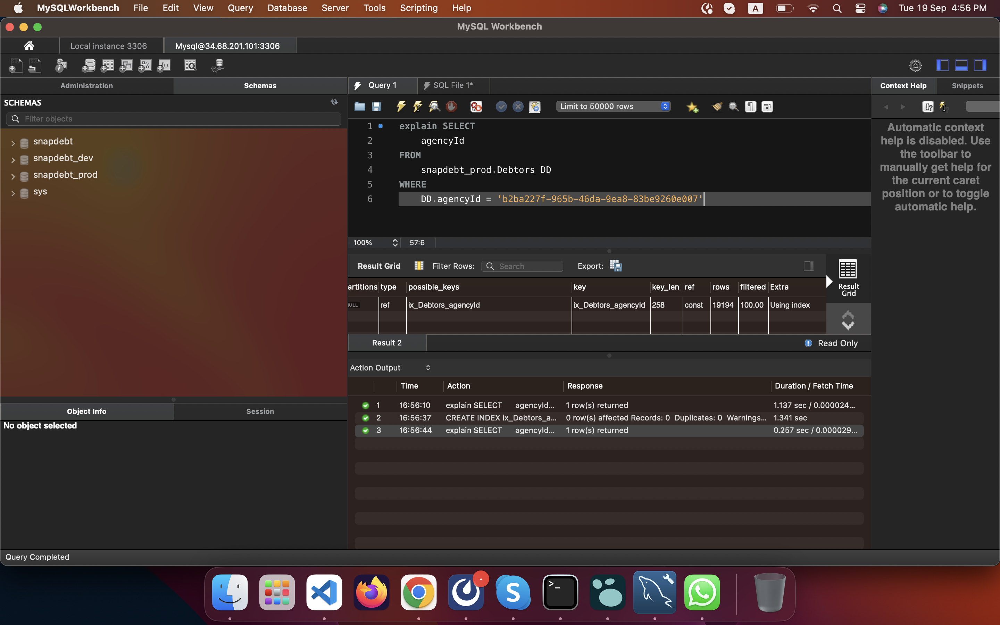

- DOING First check All Repositories and DAO. Find queries which might be taking time
  :LOGBOOK:
  CLOCK: [2023-09-16 Sat 04:29:59]
  :END:
	- AddressRepository -> No complex query
	- AgencyClientPayment Repository -> No complex query
	- AgencyRepository
		- agencyCommissionDetails -> This function is calling DAO but I don't think this one is complex query. Check how many times this query is called from frontend?
	- AgencyUserRepository -> No complex query
	- AgingScheduleRepository -> No complex query
	- BulkLetterRepository -> No complex query
	- CallLogRepository
		- fetchAllByPhoneNumber -> In this method we are fetching notes in a loop. Now this feature is disabled by Amanda and we should comment this code for now.
	- ClientPhoneNumberRepository -> No complex query
	- ClientRepository
		- fetchAllClientsForAgency -> Needs optimization. Also I am using this query for dropdown which is making a lot of requests
			- Main issue is in ClientFilter component on frontend
		- fetchAllClientsForAgencyUserWithoutPagination -> Needs optimization , should include address in query instead of calling database in a separate query. Also check how many times this api is called.
		- fetchAllClientsForAgencyUser -> Needs optimization ,should include address in query instead of calling database in a separate query. Also check how many times this api is called.
		- fetchById -> Needs optimization, making database calls in PaymentDao.agencyOwesClient(), AgencyClientPaymentDao.agencyPaidPaymentsToClient(), AgencyClientPaymentDao.clientPaidPaymentsToAgency(). Also check how many times this api is called from frontend
	- ClientUserRepository -> No complex query
	- CollectionAgentSplitCommissionRepository -> No complex query
	- ContingencyCommissionRepository -> No complex query
	- CoworkerRepository -> No complex query
	- DebtorPhoneNumberRepository -> No complex query
	- DebtorRepository -> No complex query
	- DebtRepository -> No complex query
	- DebtStatusRepository -> No complex query
	- DebtTypeRepository -> No complex query
	- ForwardAgencyRepository -> No complex query
	- GoalRepository -> No complex query
	- IntegrationRepository -> No complex query
	- LegalActionRepository
		- fetchAllDebtorLegalActions -> Needs optimization related to user
	- LetterRepository -> No complex query
	- LetterTreeRepository -> No complex query
	- MovingDebtorsLogRepository -> No complex query
	- NoteRepository
		- fetchAllClientNotes -> Need optimisation. Need to disable call log notes as this feature is disabled by amanda
	- OutlookTemplatesRepository -> No complex query
	- PaymentPlanRepository -> No complex query
	- PaymentRepository -> No complex query
	- PermissionTemplateRepository -> No complex query
	- ReminderRepository -> No complex query
	- fetchAllAgencyReportHistories -> No complex query
	- ReversedAgencyClientPaymentRepository -> No complex query
	- ReversedPaymentRepository -> No complex query
	- RevertMovingDebtorRepository -> No complex query
	- SalesAgentSplitCommissionRepository -> No complex query
	- SmsLogRepository -> No complex query
	- UserRepository
		- fetchById . Check how many times this function is called as we are making separate db call to fetch agency details
		- fetchByIdForReport. Check how many times this function is called as we are making separate db call to fetch agency details
		- fetchById is called from auth middleware , use light query for that
	- Debtor List query also need optimisation as there is a loop present in a query (done)
		-
		-
- Important Notes
	- Added agencyId index on debtors table CREATE INDEX ix_Debtors_agencyId ON snapdebt_prod.Debtors(agencyId);
	- 
	- 
	-
	-
	-